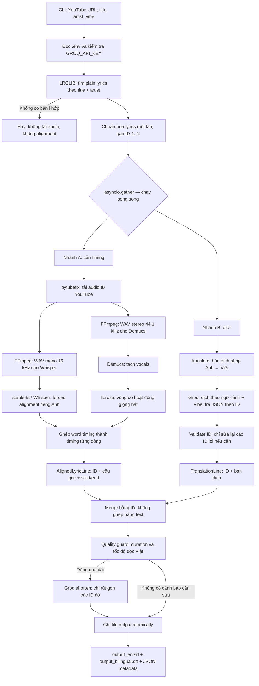

# YouTubers Assistant — tạo phụ đề song ngữ Anh–Việt cho bài hát YouTube

Tool này nhận URL YouTube cùng tên bài hát, nghệ sĩ và phong cách dịch (`vibe`), sau đó:

1. Lấy **plain lyrics** tiếng Anh từ LRCLIB.
2. Căn từng dòng lyric vào âm thanh của video.
3. Dịch từng dòng sang tiếng Việt theo ngữ cảnh cả bài.
4. Xuất SRT tiếng Anh, SRT song ngữ và các JSON để kiểm tra lại.

Đây là công cụ dòng lệnh Python, không có giao diện web hay cơ sở dữ liệu. Mọi cache và file trung gian được lưu cục bộ.

> Lưu ý bản quyền: chỉ xử lý video và lyrics mà bạn có quyền sử dụng. LRCLIB có thể không có bản plain lyrics khớp chính xác cho mọi bài.

## Luồng logic hiện tại



Điểm quan trọng nhất là **ID của dòng lyric**. Ngay sau khi lấy lyrics, mỗi dòng được đánh số ổn định từ `1` đến `N`. Timing, bản dịch và bước merge đều dựa trên ID này, nên các câu lặp như điệp khúc không bị ghép nhầm chỉ vì cùng nội dung chữ.

## Điều kiện cần trước khi chạy

| Thành phần | Mục đích | Cách có được |
| --- | --- | --- |
| Python 3.11+ | Chạy code | Khuyến nghị Python 3.11 vì đã được dùng để kiểm tra local. |
| `ffmpeg` và `ffprobe` trên `PATH` | Chuyển đổi audio | Cài riêng theo hệ điều hành. |
| `pytubefix` | Tải audio từ YouTube | Cài qua `requirements.txt`. |
| `stable-ts` / Whisper | Forced alignment lyrics–audio | Cài qua `requirements.txt`; lần đầu có thể tải model Whisper. |
| `demucs` | Tách vocal để xác định vùng hát tốt hơn | Cài qua `requirements.txt`; lần đầu có thể tải model. |
| `librosa` | Tìm các đoạn âm thanh có hoạt động | Cài qua `requirements.txt`. |
| `translate` | Tạo bản dịch nháp Anh → Việt | Là thư viện Python, không cần biến môi trường API riêng. Provider mặc định vẫn cần mạng. |
| Groq API key | Dịch ngữ cảnh và rút gọn subtitle | Cần `GROQ_API_KEY` hợp lệ trong `.env`. |

## Cài đặt

Tạo virtual environment trong thư mục dự án rồi cài dependencies:

```bash
python3.11 -m venv .venv
.venv/bin/python -m pip install -r requirements.txt
```

`ffmpeg` và `ffprobe` không thuộc `requirements.txt`. Hãy xác nhận chúng có sẵn:

```bash
ffmpeg -version
ffprobe -version
```

Tạo `.env` từ mẫu **chỉ khi chưa có `.env`**, sau đó điền key Groq của bạn:

```bash
cp .env.example .env
```

Nội dung cấu hình:

```dotenv
GROQ_API_URL=https://api.groq.com/openai/v1/chat/completions
GROQ_API_KEY=your_groq_key_here
GROQ_MODEL=llama-3.3-70b-versatile

PROVIDER_TIMEOUT_SECONDS=30
PROVIDER_MAX_RETRIES=3
```

- `.env` bị Git ignore, không đưa key vào source hoặc artifact.
- `GROQ_API_URL` và `GROQ_MODEL` có giá trị mặc định trong code; chỉ `GROQ_API_KEY` là bắt buộc.
- Mọi gọi Groq dùng HTTPS. Các lỗi mạng/429/5xx được retry hữu hạn với backoff; key không được in vào lỗi.

## Cách chạy pipeline song ngữ

```bash
.venv/bin/python bilingual_pipeline.py \
  --youtube-url 'https://www.youtube.com/watch?v=VIDEO_ID' \
  --title 'Tên bài hát' \
  --artist 'Tên nghệ sĩ' \
  --vibe 'tự nhiên, giàu cảm xúc' \
  --output output/output_bilingual.srt
```

Các tham số:

| Tham số | Bắt buộc | Ý nghĩa |
| --- | --- | --- |
| `--youtube-url` | Có | URL `watch`, `shorts` hoặc `youtu.be` của **một video** YouTube. |
| `--title` | Có | Tên bài hát dùng để tìm exact match trên LRCLIB. |
| `--artist` | Có | Tên nghệ sĩ/tác giả dùng để tìm exact match trên LRCLIB. |
| `--vibe` | Có | Hướng phong cách cho bản dịch Groq, ví dụ `mộc mạc`, `thơ mộng`, `buồn nhẹ`. |
| `--output` | Không | Đường dẫn SRT song ngữ. Mặc định là `output_bilingual.srt`. |
| `--data-dir` | Không | Thư mục audio/media trung gian. Mặc định `data/`. |
| `--cache-dir` | Không | Cache JSON. Mặc định `.bilingual_cache/`. |
| `--max-vietnamese-cps` | Không | Ngưỡng tốc độ đọc tiếng Việt; mặc định `17.0` ký tự/giây, bỏ khoảng trắng. |

Ví dụ sau ghi tất cả kết quả vào `output/`:

```bash
.venv/bin/python bilingual_pipeline.py \
  --youtube-url 'https://www.youtube.com/watch?v=dQw4w9WgXcQ' \
  --title 'Never Gonna Give You Up' \
  --artist 'Rick Astley' \
  --vibe 'tự nhiên, dễ hát theo' \
  --output output/output_bilingual.srt
```

### Output của một lần chạy thành công

Nếu `--output output/output_bilingual.srt`, chương trình tạo:

| File | Nội dung |
| --- | --- |
| `output/output_bilingual.srt` | Mỗi cue có câu tiếng Anh, dòng kế là bản dịch Việt trong ngoặc. |
| `output/output_en.srt` | Chỉ phụ đề tiếng Anh với timing đã căn. |
| `output/alignment_raw.json` | Kết quả alignment gốc từ Stable Whisper. |
| `output/translation_result.json` | Bản dịch cuối cùng theo `id`. |
| `output/pipeline_metadata.json` | Provenance LRCLIB, hash lyrics, version prompt Groq, cache hit/miss và cảnh báo chất lượng. |
| `data/<cache-key>/...` | Video/audio WAV và output Demucs cho lần căn timing đó. |
| `.bilingual_cache/<namespace>/<sha256>.json` | Cache lyrics, bản dịch nháp, Groq và alignment. |

Các file trong `data/` và `.bilingual_cache/` có thể xoá khi muốn giải phóng dung lượng; lần sau chương trình sẽ tải/căn/dịch lại nếu cache không còn. Cả hai thư mục đều bị Git ignore.

## Giải thích từng bước chi tiết

### 1. Đọc cấu hình và tạo dependency

Entry point `bilingual_pipeline.py` đọc `.env` theo dạng `KEY=VALUE` mà không ghi đè biến môi trường đã được export sẵn. Nó yêu cầu `GROQ_API_KEY`, tạo HTTP client tương thích OpenAI cho Groq, tạo dịch giả nháp `translate`, hàm lookup LRCLIB, hàm aligner và JSON cache.

Nếu thiếu key thì pipeline dừng trước khi làm việc. Nếu key bị từ chối, client trả lỗi đã làm sạch như `Provider request failed with HTTP 403.` — không in key hoặc request body.

### 2. Tìm lyrics plain từ LRCLIB

`lrclib_lyrics.py` gửi HTTP GET đến `https://lrclib.net/api/search` với `track_name` và `artist_name`.

Trước khi tìm, tên bài/nghệ sĩ được chuẩn hóa khoảng trắng, dấu nháy “smart quote” và một số dấu gạch. Khi chọn kết quả, code so khớp artist theo dạng không phân biệt hoa/thường, dấu Unicode, khoảng trắng và phần lớn dấu câu. Một fallback có kiểm soát hỗ trợ tên kiểu `P!nk`, `Ke$ha`, `AC/DC`; title vẫn cần khớp chặt để tránh lấy nhầm bài.

Chỉ `plainLyrics` được chấp nhận. Nếu không có bản khớp chính xác, pipeline dừng **trước** khi tải YouTube hoặc gọi dịch vụ dịch.

### 3. Canonicalize lyrics đúng một lần

`canonical_lyrics.py` chỉ làm ba việc:

1. Bỏ dòng trống.
2. Bỏ dòng dạng section tag, ví dụ `[Verse 1]` hoặc `[Chorus]`.
3. `strip()` đầu/cuối dòng rồi đánh ID một-based.

Nó không sửa chính tả, không đổi viết hoa, không gộp/tách dòng, không dedupe câu lặp. Dữ liệu này là nguồn chuẩn duy nhất cho cả alignment lẫn translation.

### 4A. Nhánh căn timing audio

Nhánh này được chạy trong worker thread song song với nhánh dịch sau khi canonical lyrics đã sẵn sàng.

1. `srt_maker.py` kiểm tra URL YouTube hợp lệ (watch/shorts/youtu.be).
2. `pytubefix` tải audio stream về `downloaded.mp4`.
3. `ffmpeg` tạo `yt_input.wav` mono 16 kHz cho Whisper.
4. `ffmpeg` tạo `yt_demucs.wav` stereo 44.1 kHz cho Demucs.
5. `demucs --two-stems vocals` tách vocal. Nếu thất bại, code cảnh báo và dùng full mix thay vì dừng toàn bộ pipeline.
6. `stable_whisper` (Stable-ts) load model Whisper mặc định `large`, rồi gọi forced alignment với lyrics tiếng Anh (`language='en'`). Raw result được lưu JSON.
7. Word timing từ Whisper được nhóm theo số token của từng câu lyric.
8. `librosa.effects.split` tìm vùng âm thanh hoạt động trong vocal/full mix. Timing từng dòng được clamp vào cụm hoạt động phù hợp để bớt kéo dài sang khoảng lặng.
9. Timing được map **theo vị trí với canonical ID**. Thiếu dòng, lệch text, hoặc duration không dương sẽ bị từ chối.

Điều này tạo `AlignedLyricLine(id, source, start, end)`.

### 4B. Nhánh dịch

Nhánh dịch gồm hai tầng để Groq có bản tham khảo nhanh nhưng vẫn chịu trách nhiệm về bản dịch cuối.

1. `TranslateLibraryLiteralTranslator` lazy-import `translate.Translator` và dịch từng canonical line từ `en` sang `vi`. Kết quả phải bao phủ đúng toàn bộ ID và không được rỗng.
2. `GroqTranslationService` gửi **toàn bộ bài hát**: title, artist, vibe, mỗi `id`, source English và literal draft. Prompt yêu cầu bản dịch tự nhiên, giữ ngữ cảnh/ẩn dụ/cảm xúc, nhưng bắt buộc trả đúng một JSON line cho mỗi ID.
3. `translation_workflow.py` validate chặt: `lines` phải là list; mọi ID là số nguyên; không thiếu/thừa/trùng/đảo ID; translation không được rỗng.
4. Nếu phản hồi Groq chỉ lỗi một phần, code giữ các dòng hợp lệ và gửi request repair chỉ cho các ID lỗi cùng context dòng trước/sau.

Kết quả là `TranslationLine(id, translation, needs_review)`.

### 5. Merge, quality guard và rút gọn câu

`translation_workflow.merge_by_line_id()` chỉ merge khi hai phía có đúng cùng tập ID, rồi tạo `BilingualCue`.

`quality_guard.py` kiểm tra:

- Mỗi cue phải có duration dương và ít nhất `0.25` giây. Vi phạm là lỗi dừng, vì SRT không an toàn.
- Tốc độ đọc tiếng Việt = số ký tự hiển thị (bỏ whitespace) / duration. Vượt `17.0 CPS` mặc định là warning.

Nếu có warning tốc độ đọc và translator có hàm `shorten`, pipeline gọi Groq lại chỉ cho các ID quá dài, cung cấp giới hạn ký tự ước tính từ duration. Bản rút gọn vẫn phải qua validate ID và quality guard lần nữa.

### 6. Ghi output và cache an toàn

Các file text/JSON được ghi qua file tạm rồi `os.replace`, nên nếu tiến trình bị ngắt thì không để lại bản output/cache dở dang.

Cache dùng SHA-256 của input ổn định, tách namespace `lyrics`, `literal`, `groq`, `alignment`. Cache Groq bao gồm canonical lyrics, title, artist, vibe, model/prompt version và giới hạn CPS; đổi một trong các yếu tố đó sẽ không dùng nhầm bản dịch cũ.

## Bản đồ file và ý nghĩa code

| File | Vai trò | Thành phần chính |
| --- | --- | --- |
| `bilingual_pipeline.py` | Entry point của luồng song ngữ. Điều phối cache, concurrent branches và artifact. | `PipelineRequest`, `BilingualPipeline.run()`, `build_pipeline_from_environment()`, CLI `main()`. |
| `bilingual_models.py` | Các immutable data contract dùng xuyên suốt. | `CanonicalLyricLine`, `AlignedLyricLine`, `TranslationLine`, `BilingualCue`, metadata/warning dataclass. |
| `lrclib_lyrics.py` | Client LRCLIB và CLI chỉ lấy plain lyrics. | Chuẩn hóa metadata, exact match, `lookup_lyrics_record()`, CLI `--title --artist`. |
| `canonical_lyrics.py` | Canonicalization boundary duy nhất cho lyrics. | Bỏ blank/section tag, giữ nguyên chữ còn lại, gán ID 1..N. |
| `srt_maker.py` | Media/alignment engine và CLI align độc lập. | Kiểm tra/tải YouTube, FFmpeg, Demucs, Stable-ts, librosa, tạo timing và map vào canonical ID. |
| `translation_service.py` | Dịch nháp qua `translate`, prompt và workflow gọi Groq. | `TranslateLibraryLiteralTranslator`, `GroqTranslationService`, partial repair, shorten. |
| `provider_clients.py` | HTTP client an toàn cho endpoint kiểu OpenAI. | HTTPS validation, Authorization header, JSON extraction, retry cho lỗi transient, `ProviderRequestError`. |
| `translation_workflow.py` | Validation contract cho JSON dịch và merge. | `validate_translation_response()`, `TranslationValidationError`, `merge_by_line_id()`. |
| `quality_guard.py` | Rule kiểm tra cue sau khi merge. | Minimum duration 0.25s, warning CPS tiếng Việt mặc định 17.0. |
| `bilingual_srt.py` | Renderer SRT thuần, không gọi mạng. | `render_english_srt()`, `render_bilingual_srt()`. |
| `pipeline_cache.py` | Cache file JSON và atomic write dùng chung. | SHA-256 key, `JsonFileCache`, `atomic_write_text/json`. |
| `.env.example` | Mẫu biến môi trường Groq và timeout/retry. | Không chứa secret. |
| `requirements.txt` | Python dependencies runtime. | `pytubefix`, `stable-ts`, `demucs`, `librosa`, `translate`. |
| `.gitignore` | Không commit secrets/cache/media/venv/bytecode. | `.env`, `.venv/`, `.bilingual_cache/`, `data/`, `__pycache__/`. |

## Hai CLI hiện có

### A. Pipeline song ngữ (nên dùng)

```bash
.venv/bin/python bilingual_pipeline.py --help
```

Đây là command kết hợp mọi bước và tạo SRT Anh–Việt.

### B. Chỉ tra plain lyrics LRCLIB

```bash
.venv/bin/python lrclib_lyrics.py \
  --title 'Never Gonna Give You Up' \
  --artist 'Rick Astley' \
  --output lyrics.txt
```

Không truyền `--title` hoặc `--artist` thì chương trình hỏi qua terminal. Lyrics được in ra stdout; prompt/lỗi đi stderr để có thể pipe output an toàn.

### C. Chỉ căn SRT tiếng Anh (legacy/độc lập)

```bash
.venv/bin/python srt_maker.py \
  'https://www.youtube.com/watch?v=VIDEO_ID' \
  --lyrics lyrics.txt \
  --output output_en.srt
```

CLI này dùng lyric file local thay vì LRCLIB/Groq. Nó hữu ích khi chỉ cần timing tiếng Anh hoặc muốn chẩn đoán riêng phần alignment.

## Lỗi thường gặp và cách hiểu

| Hiện tượng | Nguyên nhân thường gặp | Hướng xử lý |
| --- | --- | --- |
| `Không tìm thấy plain lyrics...` | LRCLIB không có exact match, hoặc title/artist không đúng. | Đổi metadata chính xác hơn; không có lyrics thì pipeline cố ý không chạy tiếp. |
| `ffmpeg and ffprobe must be available on PATH` | Thiếu executable hệ thống. | Cài FFmpeg, mở terminal mới và chạy lại. |
| `pytubefix not installed` / `stable-whisper not installed` | Chưa cài requirements trong Python đang chạy. | Dùng đúng `.venv/bin/python -m pip install -r requirements.txt`. |
| Demucs warning rồi tiếp tục | Demucs tách vocal thất bại. | Pipeline fallback sang full mix để clamp activity; nên xem lại timing output. |
| `Forced alignment could not cover...` | Lyrics và audio không khớp, intro/live/remix có câu khác, hoặc model alignment không bắt được toàn bộ từ. | Dùng đúng video/bản lyrics; thử căn riêng bằng `srt_maker.py` để chẩn đoán. |
| `Provider request failed with HTTP 403` | Groq key không hợp lệ/không có quyền. | Tạo hoặc thay `GROQ_API_KEY`; endpoint mặc định không cần sửa. |
| `Provider request failed with HTTP 429` | Hết quota/rate limit Groq. | Chờ hoặc dùng key/quota phù hợp; retry đã có giới hạn. |
| Vietnamese CPS warning trong metadata | Dòng dịch dài so với thời gian hiển thị. | Pipeline đã thử rút gọn qua Groq một lần; vẫn nên xem lại cue bị warning. |

## Trạng thái kiểm tra gần nhất

- Toàn bộ runtime dependency đã import thành công trong Python 3.11.
- LRCLIB đã trả plain lyrics cho bài mẫu và thư viện `translate` đã tạo bản dịch nháp thành công.
- FFmpeg và FFprobe có sẵn trên máy kiểm tra.
- Request Groq thực tế hiện trả HTTP 403 với key trong `.env`; vì vậy cần thay key/quyền Groq hợp lệ trước khi kỳ vọng một lượt YouTube → SRT hoàn chỉnh thành công.
- Không còn file test trong repository theo yêu cầu dọn dẹp.

## Nguyên tắc khi sửa code

- Đừng thay đổi lyric source sau `canonicalize_lyrics()` nếu không đồng thời hiểu tác động tới ID, cache, translation và alignment.
- Không merge theo text lyric; chỉ merge bằng `id`.
- Không hard-code Groq key và không ghi key vào JSON output/cache.
- Nếu thêm provider mới, giữ contract JSON `{ "lines": [{ "id": number, "translation": string }] }` và đi qua `validate_translation_response()`.
- Khi thay prompt/logic dịch có ảnh hưởng kết quả, đổi `GROQ_PROMPT_VERSION` để tách cache cũ khỏi cache mới.
